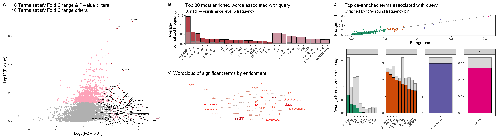

# JubRi
[](https://www.repostatus.org/#active) 
[](https://github.com/ShanSabri/deconR/graphs/commit-activity) 
[](https://cran.r-project.org/) 
[](commits/master) 
[](https://www.gnu.org/licenses/gpl-3.0)

JubRi is a R package that performs literature-based keyword ontology. JubRi utilizes a curated keyword database of roughly 18,000 genes queried using the [`PubMedScrapeR`](https://github.com/ShanSabri/PubMedScrapeR) R package. 

## Installation

Use [devtools](https://github.com/r-lib/devtools) to install JubRi directly from GitHub.

```R
# if(!require(devtools)) {install.packages(devtools)}
devtools::install_github("ShanSabri/JubRi")

```

## Usage

See [`example/example.R`](https://github.com/ShanSabri/JubRi/blob/master/example/example.R) on how to generate a metaplot of term enrichments given a query set, shown below: 


## Contributing
Pull requests are welcome. For major changes, please open an issue first to discuss what you would like to change.

Please make sure to update tests as appropriate.

## License
[ GPL-3](https://www.gnu.org/licenses/gpl-3.0.en.html)

